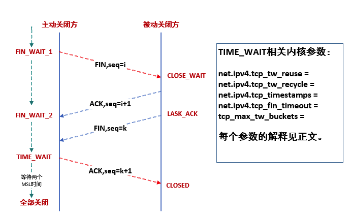

# TIME_WAIT

TCP可靠的四次挥手关闭连接过程

## TIME_WAIT的产生条件

主动关闭方在发送四次挥手的最后一个ACK会变为TIME_WAIT状态，保留次状态的时间为两个MSL（linux里一个MSL为30s，是不可配置的）

## TIME_WAIT两个MSL的作用

可靠安全的关闭TCP连接。比如网络拥塞，主动方最后一个ACK被动方没收到，这时被动方会对FIN开启TCP重传，发送多个FIN包，在这时尚未关闭的TIME_WAIT就会把这些尾巴问题处理掉，不至于对新连接及其它服务产生影响。

## TIME_WAIT占用的资源

少量内存（查资料大概4K）和一个fd。

## TIME_WAIT关闭的危害

1. 网络情况不好时，如果主动方无TIME_WAIT等待，关闭前个连接后，主动方与被动方又建立起新的TCP连接，这时被动方重传或延时过来的FIN包过来后会直接影响新的TCP连接；

2. 同样网络情况不好并且无TIME_WAIT等待，关闭连接后无新连接，当接收到被动方重传或延迟的FIN包后，会给被动方回一个RST包，可能会影响被动方其它的服务连接。

## TCP: time wait bucket table overflow 产生原因及影响

原因是超过了linux系统tw数量的阀值。危害是超过阀值后，系统会把多余的time-wait socket 删除掉，并且显示警告信息，如果是NAT网络环境又存在大量访问，会产生各种连接不稳定断开的情况。

## 相关参数优化调整

既然知道了TIME_WAIT的用意了，尽量按照TCP的协议规定来调整，对于tw的reuse、recycle其实是违反TCP协议规定的，服务器资源允许、负载不大的条件下，尽量不要打开，当出现TCP: time wait bucket table overflow，尽量调大下面参数：

> tcp_max_tw_buckets = 256000

调整次参数的同时，要调整TIME_WAIT_2到TIME_WAIT的超时时间，默认是60s，优化到30s：

> net.ipv4.tcp_fin_timeout = 30

linux里TIME_WAIT专有的优化参数reuse、recycle，默认也都是关闭的，这两个参数必须在timestamps打开的前提下才能生效使用：

> net.ipv4.tcp_timestamps = 1
> net.ipv4.tcp_tw_reuse = 1

机器作为客户端时起作用，开启后time_wait在一秒内回收

> net.ipv4.tcp_tw_recycle = 0 # （不要开启，现在互联网NAT结构很多，可能直接无法三次握手）

开启后在3.5*RTO(RTO时间是根据RTT时间计算而来)内回收TIME_WAIT，并60s内同一源ip主机的socket connect请求中的timestamp必须是递增的，对于服务端，同一个源ip可能会是NAT后很多机器，这些机器timestamp递增性无可保证，服务器会拒绝非递增请求连接，直接导致不能三次握手。
