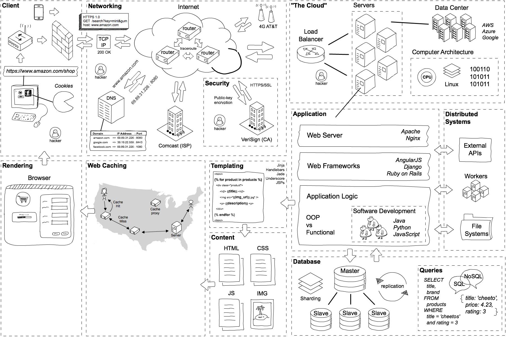

# How web applications work

1. Client (What happens when you click Order Now?)
2. Networking (How does information travel across internet?)
3. Security (How do we prevent hackers from stealing our passwords?)
4. Server (What does “the cloud” mean exactly?)
5. Application (What are web servers and web frameworks?)
6. Database (How do applications retrieve data? SQL vs NoSQL?)
7. Scaling (How do applications handle millions of requests?)
8. Rendering (How do browsers work? Basics of JavaScript.)

